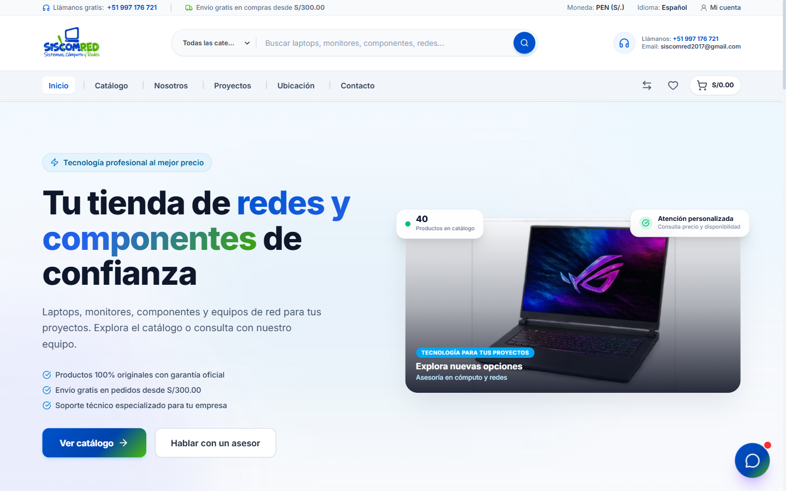
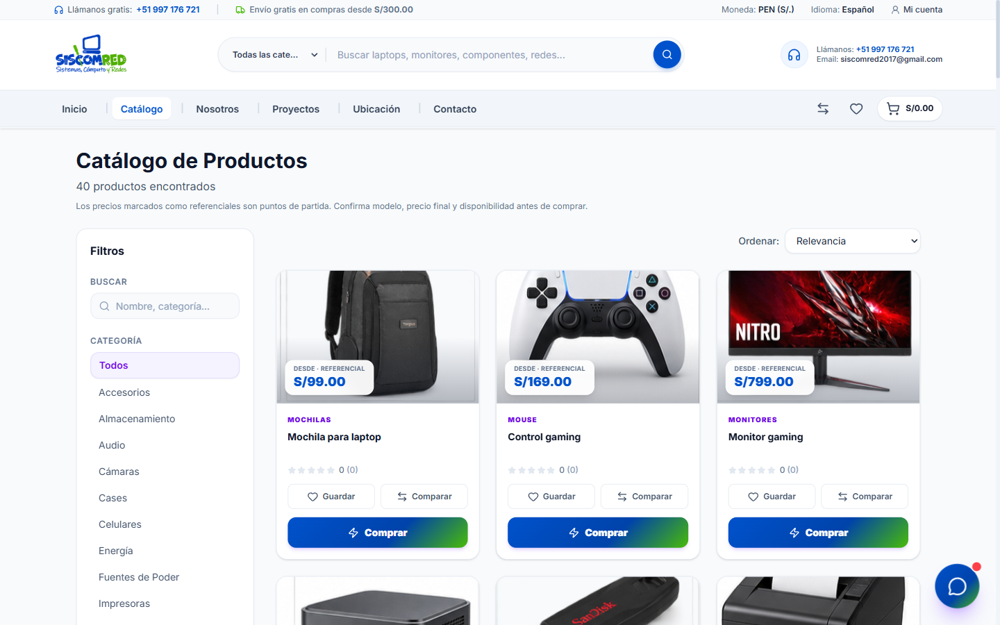
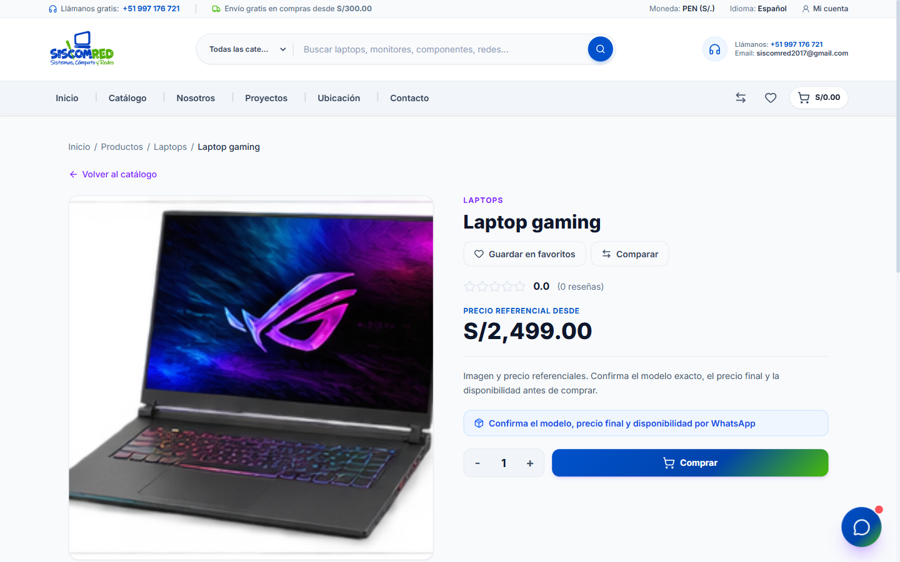
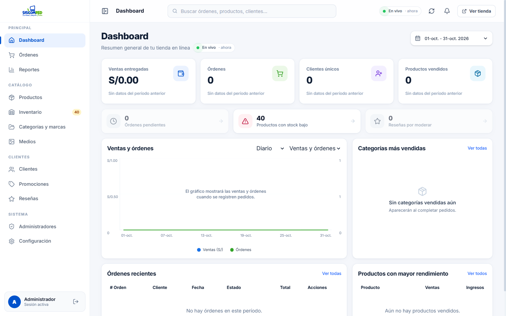
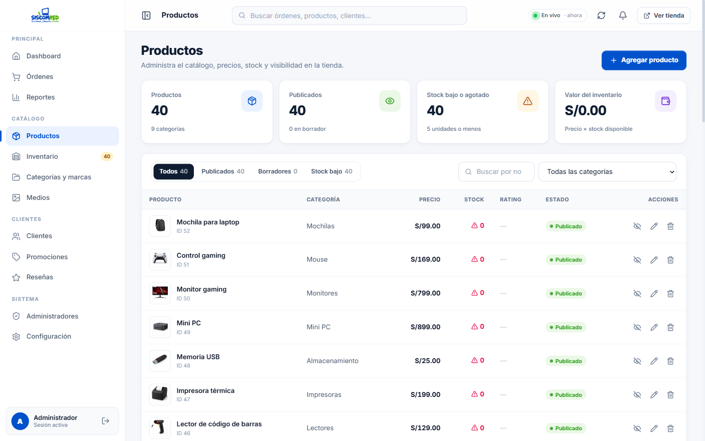
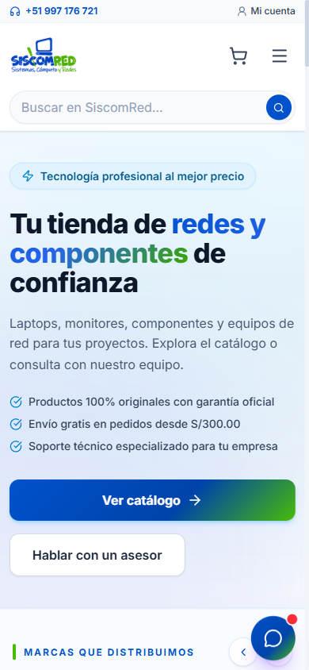
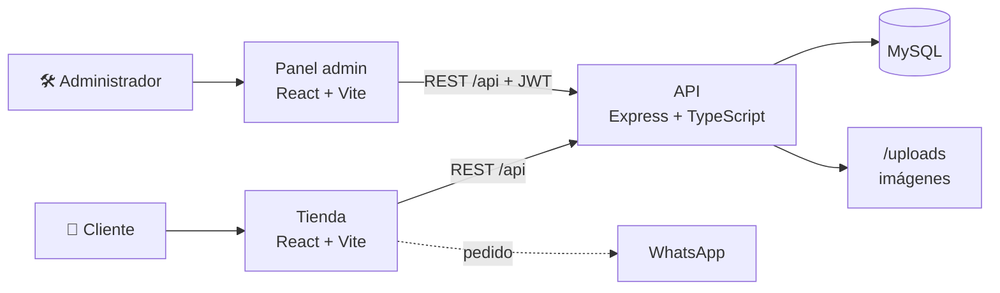

<div align="center">


<br />
<br />

**Tienda online de tecnología con panel de administración en tiempo real.**
<br />
Catálogo de productos, carrito con pedidos por WhatsApp y una API propia sobre MySQL.

<br />

[](https://tecomred.vercel.app)
[](LICENSE)


<br />

[Vista previa](#-vista-previa) ·
[Características](#-características) ·
[Inicio rápido](#-inicio-rápido) ·
[API](#-api) ·
[Despliegue](#-despliegue) ·
[Licencia](#-licencia)

</div>

<br />

## ✦ Vista previa

<div align="center">
  
  <sub><b>Inicio</b> — portada con buscador, categorías y acceso directo a un asesor</sub>
</div>

<br />

<table>
  <tr>
    <td width="50%" align="center">
      
      <sub><b>Catálogo</b> — filtros por categoría, búsqueda y orden</sub>
    </td>
    <td width="50%" align="center">
      
      <sub><b>Producto</b> — favoritos, comparador y compra rápida</sub>
    </td>
  </tr>
  <tr>
    <td width="50%" align="center">
      
      <sub><b>Panel · Dashboard</b> — ventas, órdenes y alertas en vivo</sub>
    </td>
    <td width="50%" align="center">
      
      <sub><b>Panel · Productos</b> — precios, stock y publicación</sub>
    </td>
  </tr>
</table>

<details>
<summary><b>📱 Ver versión móvil</b></summary>
<br />
<div align="center">
  
</div>
</details>

<br />

## ✦ Características

<table>
  <tr>
    <td valign="top" width="33%">

**🛒 Tienda**

- Catálogo con filtros, búsqueda y autocompletado
- Ficha de producto con reseñas
- Favoritos y comparador de productos
- Carrito y checkout con pedido por WhatsApp
- Asistente de chat integrado
- SEO dinámico por página y diseño responsive

</td>
    <td valign="top" width="33%">

**📊 Panel de administración**

- Dashboard con ventas y órdenes en tiempo real
- Gestión de productos, inventario y categorías
- Biblioteca de medios con subida de imágenes
- Clientes, promociones, cupones y reseñas
- Reportes y analítica de visitantes en vivo
- Administradores con roles y configuración

</td>
    <td valign="top" width="33%">

**🔐 Seguridad**

- Autenticación con JWT
- Contraseñas cifradas con bcrypt
- Validación de datos con Zod (cliente y API)
- Cabeceras seguras con Helmet
- Límite de peticiones (rate limiting)
- CORS restringido al dominio de la tienda

</td>
  </tr>
</table>

<br />

## ✦ Arquitectura



| Capa | Tecnología | Hosting |
| :--- | :--- | :--- |
| **Frontend** | React 19, TypeScript, Vite 8, Tailwind CSS 4, React Router 7, SweetAlert2 | Vercel |
| **Backend** | Node.js, Express 5, Zod, JWT, Multer, Helmet | Railway |
| **Base de datos** | MySQL 8 | Railway / Laragon en local |

<br />

## ✦ Estructura del proyecto

```text
Tecomred/
├── frontend/              Tienda y panel de administración (React + Vite)
│   ├── public/            Logo, imágenes de productos y marcas
│   └── src/
│       ├── components/    Componentes de UI reutilizables
│       ├── context/       Estado global (carrito, admin, analítica)
│       ├── pages/         Páginas de la tienda
│       │   └── admin/     Páginas del panel
│       └── utils/         Utilidades y validaciones
├── backend/               API REST (Express + TypeScript)
│   ├── scripts/           Migraciones, semillas e importación del catálogo
│   └── src/
│       ├── routes/        Endpoints de la API
│       ├── controllers/   Lógica de cada recurso
│       ├── data/          Acceso a MySQL
│       └── middleware/    Autenticación y manejo de errores
├── docs/                  Imágenes de este README
├── vercel.json            Configuración de despliegue del frontend
└── package.json           Scripts del monorepo
```

<br />

## ✦ Inicio rápido

### Requisitos

- **Node.js 22** o superior
- **MySQL 8** (por ejemplo, con [Laragon](https://laragon.org/) en Windows)

### 1 · Clonar e instalar

```bash
git clone https://github.com/Demonio6sat6-Team/Tecomred.git
cd Tecomred
npm install
npm --prefix frontend install
npm --prefix backend install
```

### 2 · Configurar variables de entorno

```bash
cp backend/.env.example backend/.env
cp frontend/.env.example frontend/.env
```

| Variable | Dónde | Descripción |
| :--- | :--- | :--- |
| `PORT` | backend | Puerto de la API (por defecto `4000`) |
| `CORS_ORIGIN` | backend | Dominio autorizado para llamar a la API |
| `ADMIN_USER` / `ADMIN_PASSWORD` | backend | Credenciales del primer administrador |
| `ADMIN_API_KEY` | backend | Clave aleatoria para firmar los tokens |
| `MYSQL_HOST` / `MYSQL_USER` / `MYSQL_PASSWORD` / `MYSQL_DATABASE` | backend | Conexión a MySQL |
| `VITE_API_URL` | frontend | URL de la API (en local se usa `/api`) |

> [!IMPORTANT]
> Nunca subas los archivos `.env` al repositorio. Usa contraseñas y claves únicas en producción.

### 3 · Crear la base de datos

```bash
npm --prefix backend run db:setup
```

### 4 · Levantar el proyecto

```bash
npm run dev
```

| Servicio | URL |
| :--- | :--- |
| Tienda | http://localhost:5173 |
| Panel de administración | http://localhost:5173/admin |
| API (healthcheck) | http://localhost:4000/api/health |

<br />

## ✦ Scripts

| Comando | Qué hace |
| :--- | :--- |
| `npm run dev` | Levanta frontend y backend a la vez |
| `npm run dev:frontend` | Solo la tienda y el panel |
| `npm run dev:backend` | Solo la API |
| `npm run build` | Compila frontend y backend para producción |
| `npm run lint` | Revisa el código de ambos proyectos |
| `npm --prefix backend run db:migrate` | Aplica las migraciones de MySQL |
| `npm --prefix backend run db:seed` | Carga los datos iniciales |

<br />

## ✦ API

Todas las rutas están bajo `/api`. Las operaciones de escritura requieren el encabezado `Authorization: Bearer <token>`.

| Recurso | Ruta | Descripción |
| :--- | :--- | :--- |
| Salud | `/api/health` | Estado del servicio |
| Autenticación | `/api/auth` | Inicio de sesión de administradores y clientes |
| Productos | `/api/products` | Catálogo (`?active=true` para los publicados) |
| Órdenes | `/api/orders` | Pedidos y cambios de estado |
| Medios | `/api/media` | Subida y biblioteca de imágenes |
| Reseñas | `/api/reviews` | Reseñas y moderación |
| Cupones | `/api/coupons` | Promociones y cupones de descuento |
| Analítica | `/api/analytics` | Visitas y métricas en tiempo real |
| Administradores | `/api/administrators` | Gestión de cuentas del panel |
| Configuración | `/api/settings` | Datos de la tienda y contenido editable |
| Contacto / Newsletter | `/api/contact`, `/api/newsletter` | Formularios públicos |

<br />

## ✦ Despliegue

| Parte | Plataforma | Notas |
| :--- | :--- | :--- |
| **Frontend** | Vercel | Usa el `vercel.json` de la raíz: compila `frontend/` y publica `frontend/dist` |
| **Backend + MySQL** | Railway | Ejecuta `npm run build` y `npm start` dentro de `backend/` |

La rama de producción es **`master`**. Configura en Vercel la variable `VITE_API_URL` con la URL pública de la API, y en Railway las variables del backend.

<br />

## ✦ Licencia

<table>
  <tr>
    <td>
      <b>© 2026 SiscomRed — Sistemas, Cómputo y Redes. Todos los derechos reservados.</b>
      <br /><br />
      Este es un software <b>propietario</b>. El código se puede ver en GitHub, pero <b>no está permitido</b> copiarlo, modificarlo, distribuirlo, revenderlo ni usarlo en otros proyectos sin autorización previa y por escrito del titular.
      <br /><br />
      Lee los términos completos en <a href="LICENSE"><code>LICENSE</code></a>.
    </td>
  </tr>
</table>

<br />

<div align="center">

**SiscomRed** · Sistemas, Cómputo y Redes · Perú

[tecomred.vercel.app](https://tecomred.vercel.app) · [siscomred2017@gmail.com](mailto:siscomred2017@gmail.com)

<sub>Hecho con dedicación por el equipo de <a href="https://github.com/Demonio6sat6-Team">Demonio6sat6-Team</a></sub>

</div>
